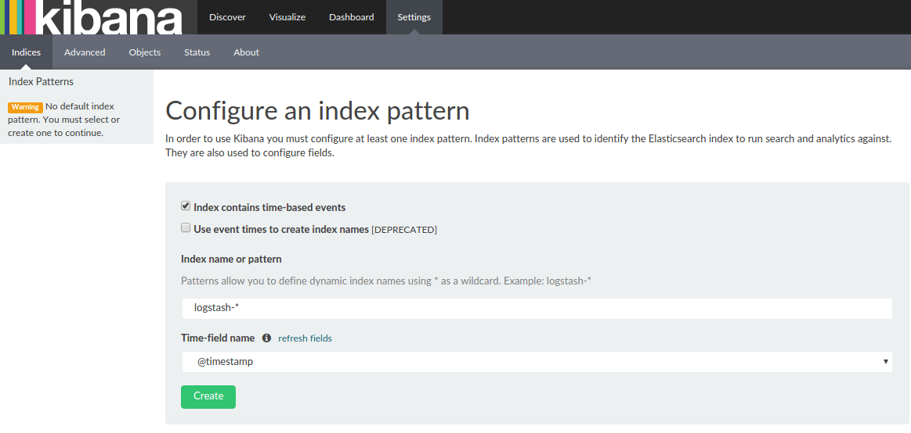
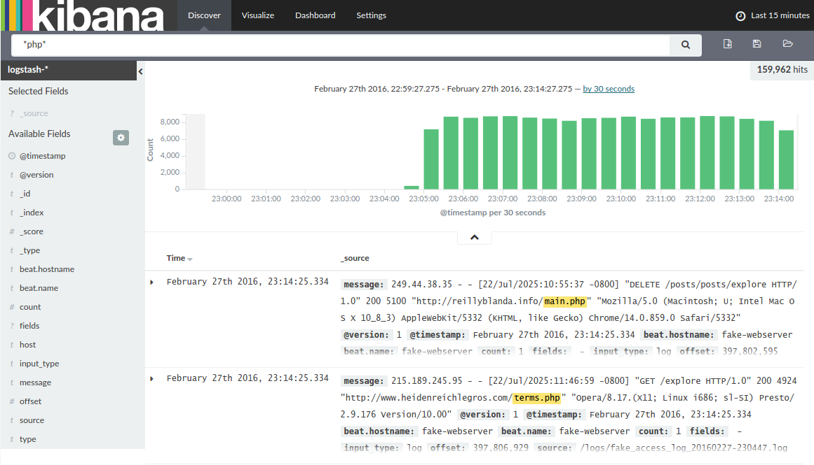
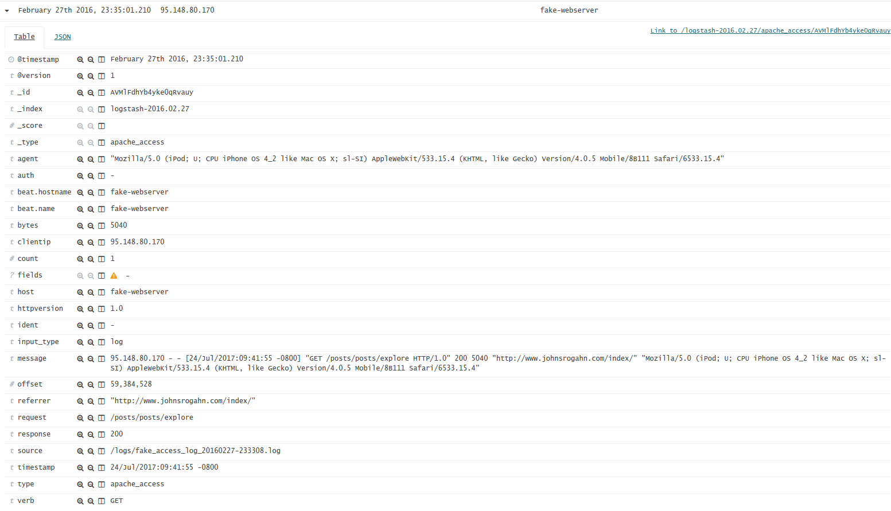
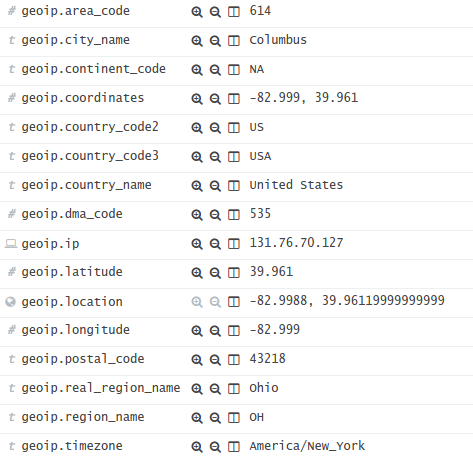
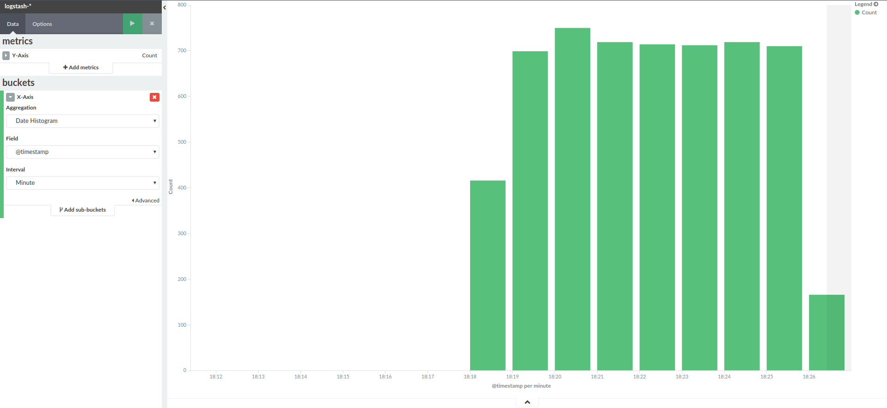
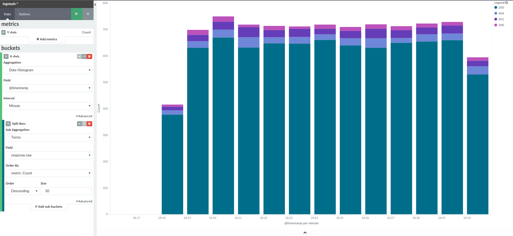
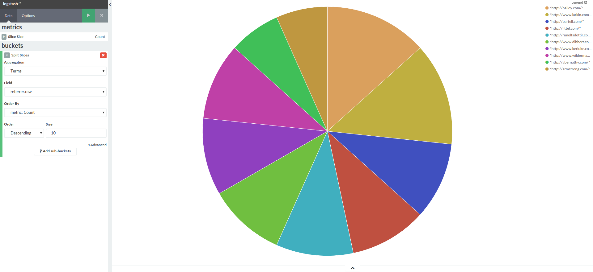
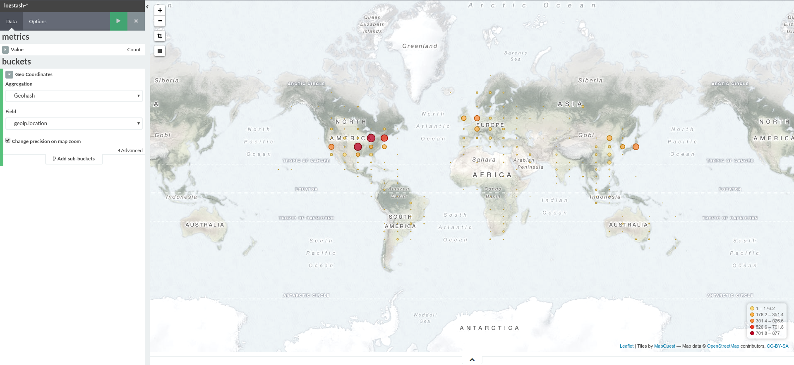

# DevOps Playground #2 - ELK Stack
This is the accompanying repo to DevOps Playground #2.

## Aim
The aim of this playground is to:
* Teach you a little about the [ELK](https://www.elastic.co/webinars/introduction-elk-stack) stack
* Parse some fake Apache webserver logs with Logstash and send them to Elasticsearch
* Create dashboards from the data using Kibana and analyse some of the data.

## Included Components
You will notice a [Vagrantfile](Vagrantfile) and a [docker-compose](docker-compose.yml) file in the repository.

The [Vagrantfile](Vagrantfile) is provided for users who don't have docker installed on their laptop or don't want to install it. You can use the vagrant vm - or run the stack using [docker-compose](https://docs.docker.com/compose/). Upto you!

To run the [docker-compose](docker-compose.yml) file without the Vagrant VM - you will need to install docker and docker-compose on your machine.

**Note:** We will also distribute a VM  image with all the required components at the labs if you haven't managed to get vagrant or docker working.


## Running the Components
First clone this repository somewhere.

To start the vm with vagrant:
```shell
# cd into the location where you cloned this repo.
$ cd /path/where/i/cloned/this/repo

# Run the vagrant box
$ vagrant up

# SSH onto the box
$ vagrant ssh
```

To do this you will need to have installed both [Vagrant](https://www.vagrantup.com/docs/installation/) and [Virtualbox](https://www.virtualbox.org/wiki/Downloads)

To start the docker-compose environment:
```shell
# cd into the location where you cloned this repo.
$ cd /path/where/i/cloned/this/repo

# Ensure all images are built
$ docker-compose build
```

## Accessing the Components
* **kibana:** http://localhost:5601
* **elasticsearch:** http://localhost:9200

## Log generation
We have a python script [fake-webserver/apache-fake-log-gen.py](fake-webserver/apache-fake-log-gen.py) which generates fake apache access logs.

## Log Sender configuration
To forward the logs from the fake webserver container to the logstash container for processing, [file-beat](https://www.elastic.co/products/beats/filebeat) is used.

Filebeat is part of the beats family and is intended to replace tools like syslog, rsyslog and logstash forwarder. It's very lightweight and written in the go language so is also cross platform.

Let's pick apart the [configuration file](fake-webserver/filebeat.yml) a little:

The first section defines some prospectors, these define which log files will be processed by filebeat. In this case we are interested in the apache log which is being generated by the fake webserver container.
```yaml
prospectors:
  - paths:
      # Look in the logs directory for fake apache logs.
      - /logs/fake*.log
```

The second section defines where filebeat will send the processed lines:
```yaml
output:
  logstash:
    hosts:
      - "logstash:5044"
```
Here we have defined a single output - our logstash container on port `5044`.

**Note**: It is possible to do some processing on the logfiles with filebeat. For this exercise we'll just use logstash to do all the processing instead.

## Log Receiver config
To receive and process the logs, we are using logstash. We need to setup logstash to process the logs.

In the [logstash config file](conf/logstash.conf) you can see how a basic logstash configuration will look.

We define inputs and outputs. For the *input* section, we are receiving a beat (from our filebeat plugin) and telling logstash to listen on port `5044` for them.
```
input {
  beats { port => 5044 }
}
```

At the other end we will send the processed json document to stdout:
```
output {
  stdout {}
}
```
There is also a section which outputs debug info to the console.

## Playground Steps
### 1. Start up the environment
Lets start up the environment and take a quick look at the output.

Open up a shell and head to the location where you cloned this repository. If you are using vagrant, make sure you are ssh'd onto the vagrant machine and then head to `/vagrant/`, the necessary files will be in there.

Start the environment with the following command:
```bash
$ docker-compose up
```

You should start to see alot of output in your shell once the environment comes up. It'll look something like the following:
```
logstash_1      | 2016-02-27T22:43:56.490Z fake-webserver 168.51.3.210 - - [04/Mar/2016:08:45:40 -0800] "GET /app/main/posts HTTP/1.0" 200 4944 "http://www.barrows.com/homepage.asp" "Mozilla/5.0 (Macintosh; U; PPC Mac OS X 10_8_4 rv:4.0; sl-SI) AppleWebKit/531.31.5 (KHTML, like Gecko) Version/4.1 Safari/531.31.5"
logstash_1      | 2016-02-27T22:43:56.490Z fake-webserver 64.9.80.139 - - [04/Mar/2016:08:47:31 -0800] "GET /list HTTP/1.0" 200 4913 "http://www.bode.com/post/" "Mozilla/5.0 (Windows; U; Windows 98; Win 9x 4.90) AppleWebKit/534.5.4 (KHTML, like Gecko) Version/5.0.3 Safari/534.5.4"
logstash_1      | 2016-02-27T22:43:56.490Z fake-webserver 44.203.82.189 - - [04/Mar/2016:08:49:51 -0800] "GET /list HTTP/1.0" 200 4978 "http://hettinger.com/main/tags/blog/home/" "Mozilla/5.0 (Macintosh; PPC Mac OS X 10_7_4; rv:1.9.3.20) Gecko/2012-07-16 17:11:32 Firefox/3.6.15"
logstash_1      | 2016-02-27T22:43:56.490Z fake-webserver 50.95.126.95 - - [04/Mar/2016:08:53:11 -0800] "GET /search/tag/list HTTP/1.0" 200 5013 "http://schumm.com/category/app/category/home.html" "Mozilla/5.0 (Macintosh; U; PPC Mac OS X 10_6_3; rv:1.9.6.20) Gecko/2014-02-01 21:48:59 Firefox/12.0"
logstash_1      | 2016-02-27T22:43:56.490Z fake-webserver 227.156.252.42 - - [04/Mar/2016:08:57:50 -0800] "GET /apps/cart.jsp?appID=8554 HTTP/1.0" 200 5011 "http://www.ritchie.info/" "Mozilla/5.0 (X11; Linux x86_64; rv:1.9.5.20) Gecko/2015-12-22 23:15:45 Firefox/3.6.20"
logstash_1      | 2016-02-27T22:43:56.490Z fake-webserver 36.192.242.156 - - [04/Mar/2016:08:59:55 -0800] "POST /apps/cart.jsp?appID=4842 HTTP/1.0" 200 4885 "http://www.rippin.biz/terms.asp" "Mozilla/5.0 (Windows NT 6.1) AppleWebKit/5332 (KHTML, like Gecko) Chrome/15.0.888.0 Safari/5332"
logstash_1      | 2016-02-27T22:43:56.490Z fake-webserver 46.97.239.239 - - [04/Mar/2016:09:03:36 -0800] "GET /wp-admin HTTP/1.0" 200 5169 "http://lindgren.biz/post/" "Mozilla/5.0 (Windows NT 5.0; it-IT; rv:1.9.1.20) Gecko/2012-06-24 03:46:18 Firefox/3.6.19"
logstash_1      | 2016-02-27T22:43:56.490Z fake-webserver 185.176.122.190 - - [04/Mar/2016:09:06:02 -0800] "DELETE /app/main/posts HTTP/1.0" 200 5063 "http://www.sipes.com/" "Mozilla/5.0 (Windows; U; Windows NT 6.0) AppleWebKit/533.35.3 (KHTML, like Gecko) Version/5.0.5 Safari/533.35.3"
```

You can see the the log generator is working and filebeat is fowarding the logs onto logstash correctly, logstash is currently doing some basic processing of the log and then writing the result to stdout.

Lets bring down the stack and make some config changes. Hit `Ctrl + c` to gracefully stop the stack.

### 2. Setup logstash to foward to elasticsearch
You may have noticed that we haven't yet involved elasticsearch, we are currently just throwing away all of the processed logs.

Lets configure logstash to send logs to the elasticsearch instance.

Add the following output section to [conf/logstash.conf](conf/logstash.conf) above the stdout output.
```
elasticsearch { hosts => ["elasticsearch:9200"] }
```

*Note the that we are referring to the elasticsearch container with the hostname `elasticsearch`, this is because we set up links between the containers in out docker-compose definition.*

Start the stack up again with docker-compose.

### 3. Check out the kibana dashboard
We should now be able to view the logs in kibana.

Open a web browser and head to the kibana dashboard (localhost:5601)

Kibana needs to be told which indexes to look for in elasticsearch (index's are akin to databases in the relational DB world). Setup it up like the following:


Click create, now we should be able to see all of the logstash indexes in kibana

Click on on the discover tab on the top menu, you should be able to see our log documents now, each log line will be a document.

Try search for '*php*' in the search bar


Let's bring the environment down again so we can make some more config changes.

### 4. Parsing the log lines into more meaningful fields.
Currently each logline is sent to elasticseach as a single string. This is pretty restrictive, and doesn't allow us to specify types. It also makes searching a little restrictive.

We can use logstash to parse each log line to give us more fine-grained information. Lets create a new section in [conf/logstash.conf](conf/logstash.conf) to parse our log lines Add the following section between the input and output sections:
```
filter {
  if [source] =~ "access" {
    mutate { replace => { "type" => "apache_access" } }
    grok {
      match => { "message" => "%{COMBINEDAPACHELOG}" }
    }
    date {
      match => [ "timestamp" , "dd/MMM/yyyy:HH:mm:ss Z" ]
    }
  }
}
```
Seeing apache logs are so common, There is a pre-written grok match pattern (`%{COMBINEDAPACHELOG}`). A list of available patterns is available [here](https://github.com/elastic/logstash/blob/v1.4.2/patterns/grok-patterns) and information on writing custom patterns is available [here](https://www.elastic.co/guide/en/logstash/current/plugins-filters-grok.html)

Start the environment up with compose again and head to kibana in your browser. Note that you can use the `docker-compose start` command to avoid spraying your shell with container logs every time.

You should see that our log line is now split out into relevant fields, and the document type has changed to `apache_access`



Now we can make queries like `response:200` or `response:[200 TO 299]`

Lets shut down all of the services again.

### 5. Enable Geo-IP detection
We can also store information about the origin of the IP address which made the request.

Add the following lines into filter section of the logstash config:
```
filter {
  if [source] =~ "access" {
    mutate { replace => { "type" => "apache_access" } }
    grok {
      match => { "message" => "%{COMBINEDAPACHELOG}" }
    }
    date {
      match => [ "timestamp" , "dd/MMM/yyyy:HH:mm:ss Z" ]
    }
    geoip {
      source => "clientip"
      target => "geoip"
      add_field => [ "[geoip][coordinates]", "%{[geoip][longitude]}" ]
      add_field => [ "[geoip][coordinates]", "%{[geoip][latitude]}"  ]
    }
    mutate {
      convert => [ "[geoip][coordinates]", "float"]
    }
  }
}
```

Start all the services again using docker-compose

You Should now see a bunch of GeoIP fields on each document.


### 6. Using kibana to visualize the apache logs
#### 6.1 Requests per minute
Now we have some data going into elasticsearch, we can start to visualize it with kibana.

Lets start with a simple graph. Requests over time:

Click visualize in the top navigation tabs and create a new Vertical bar chart -> From a new search

Create a new x-axis bucket. To get something display we need to select some metric for the x-axis.

Select the date histogram aggregation and set the interval to 'minute'. Clicking the play icon near the top of the graph config panel will render the graph.

We now have a graph of requests per minute.



#### 6.2 Requests per minute by response code
Lets make the graph a little more interesting and break down each bar by request status:

Add a sub-bucket: Add sub-buckets -> Split Bars -> Aggregation: Terms -> Field: `response.raw`, Size: `50`

Click the play icon again to render the graph:



Let's save the graph, call it something like 'Requests/min by response'

#### 6.3 Top refferers and requests
Create a new vertical Pie chart.

Split Slices -> Aggregation: Terms -> Field: `refferer.raw`, Size: `10`

Save the graph and call it 'top 10 refferers'



Modify the graph so the Term field is `request.raw` and save a copy as 'top 10 requests'

#### 6.4 Requests by origin
Create a new Tile map graph

Click Geo Coordinates under the buckets heading, kibana should pick up the correct field automatically. Click the play symbol to render the graph.

We now have world view heat map of where our web requests are coming from!

Save the graph as 'Requests by location'



#### 6.5 Dashboard
You now have several visualisation to be able to create a dashboard. Head to the Dashboard tab, which will give you instructions on how to add graphs to it.

## References
* https://docs.docker.com/compose/compose-file/
* https://hub.docker.com/_/logstash/
* https://hub.docker.com/_/kibana/
* https://hub.docker.com/_/elasticsearch/
* https://www.elastic.co/guide/en/beats/filebeat/current/filebeat-configuration-details.html#configuration-filebeat-options
* https://www.elastic.co/guide/en/logstash/current/configuration.html
* https://www.elastic.co/guide/en/logstash/current/config-examples.html
* https://www.elastic.co/guide/en/logstash/current/plugins-inputs-beats.html
